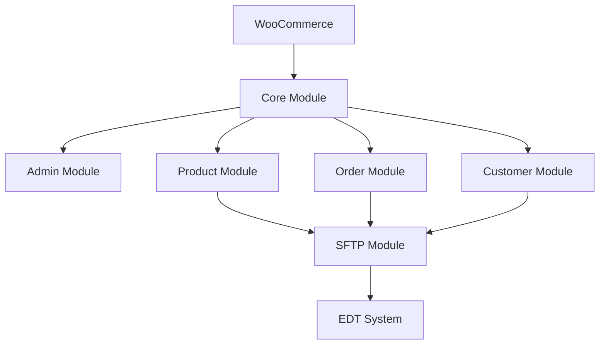

# WDM Edge Integration Architecture

## Overview
The WDM Edge Integration plugin is designed to seamlessly connect WooCommerce with Edge Distribution Technologies (EDT) system. The architecture follows WordPress plugin development best practices and SOLID principles.

## Core Architecture Principles

### 1. Modular Design
- Each major functionality is encapsulated in its own module
- Modules communicate through well-defined interfaces
- Loose coupling between components for maintainability
- Easy to extend and modify individual modules

### 2. WordPress Integration
- Proper use of WordPress hooks and filters
- Adherence to WordPress coding standards
- Integration with WooCommerce hooks
- Respect for WordPress lifecycle events

### 3. Security First
- Data encryption for sensitive information
- Secure SFTP implementation
- Input validation and sanitization
- Error logging and monitoring
- Access control and capability checks

## Component Structure

### Core Module
- Plugin initialization and lifecycle management
- Common utilities and helpers
- Hook registration and management
- Internationalization support

### Admin Module
- Settings management
- User interface components
- AJAX handlers
- Dashboard widgets
- Configuration validation

### Product Module
- Product data synchronization
- Category mapping
- Inventory management
- Price handling
- Image processing

### Order Module
- Order status management
- Order data mapping
- Fulfillment tracking
- Error handling

### Customer Module
- Customer data management
- Privacy compliance
- Data synchronization
- Profile management

### SFTP Module
- Connection management
- File operations
- Error recovery
- Security implementation

## Data Flow



## File Structure
```
wdm-edge-integration/
├── admin/               # Admin interface and settings
├── includes/           # Core plugin files
├── public/            # Public-facing functionality
├── languages/         # Internationalization
└── assets/           # CSS, JS, and media files
```

## Design Patterns

### 1. Singleton Pattern
- Used for core plugin class
- Ensures single instance of critical components

### 2. Factory Pattern
- Creates data mappers for different entities
- Manages object creation complexity

### 3. Observer Pattern
- Implements WordPress action/filter hooks
- Handles event-driven operations

### 4. Strategy Pattern
- Manages different sync strategies
- Handles various data formats

## Error Handling
- Comprehensive error logging
- Graceful failure handling
- User-friendly error messages
- Debug mode support

## Performance Considerations
- Caching implementation
- Batch processing for large datasets
- Asynchronous operations where appropriate
- Database query optimization

## Security Measures
- Data encryption at rest
- Secure communication channels
- Access control implementation
- Input validation and sanitization
- XSS and CSRF protection 